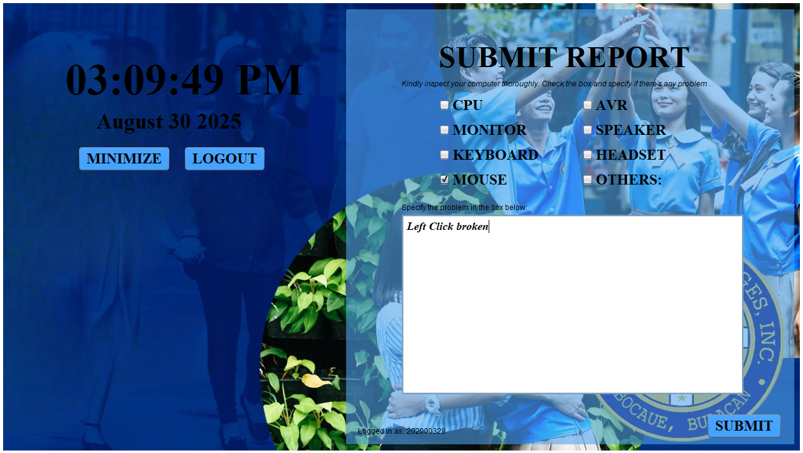
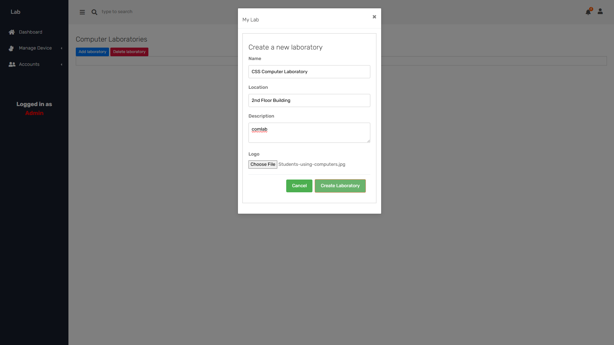
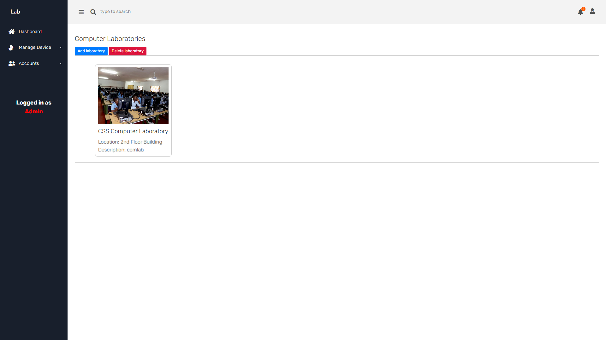
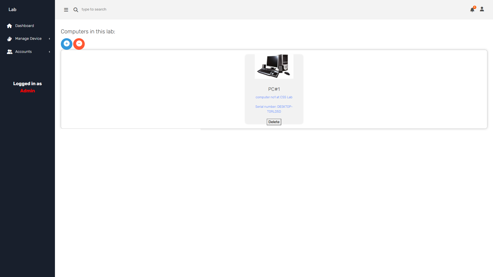
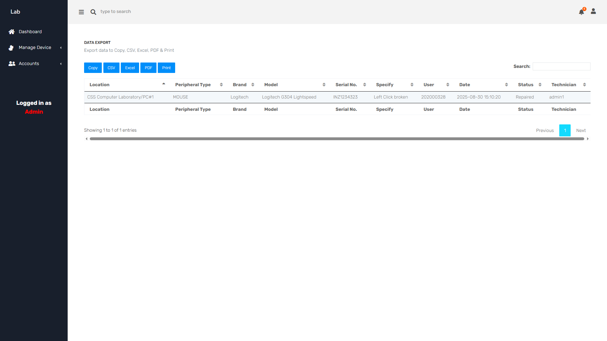
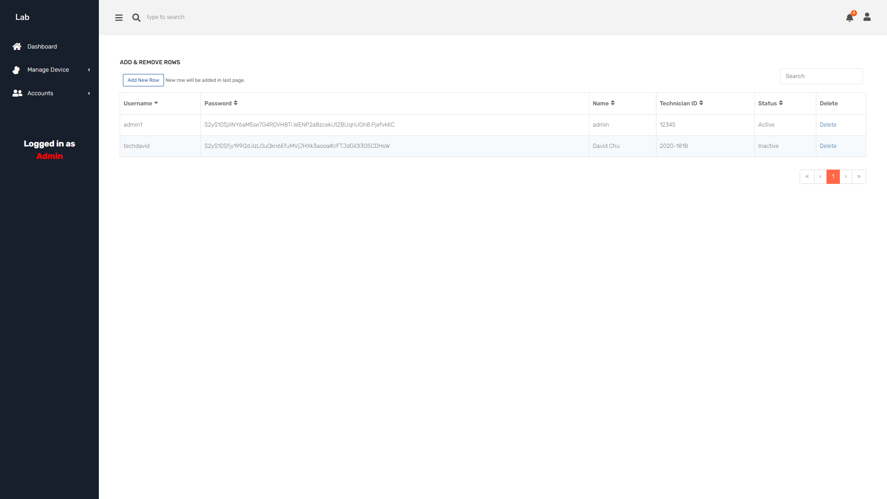
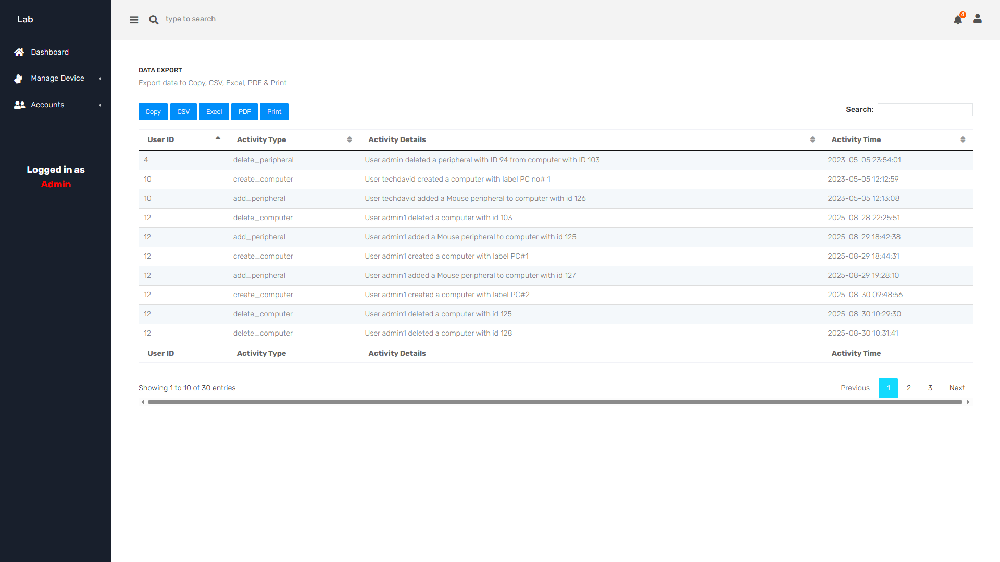
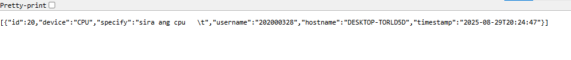

# ComLab Project

This is my Computer Laboratory Project built with **PHP**, **MySQL**, and a **Spring Boot API** for reports.  

> **Note:** The UI uses Pixel Admin 2, but the template is **not included**. Some UI bugs exist, but the backend logic works.

---

## Features

- User login and session management  
- Dashboard to manage laboratories and peripherals  
- CRUD operations for peripherals per computer and per lab  
- **Spring Boot API** provides JSON reports  
- Inline JavaScript and CSS for dynamic functionality  

---

## Setup / How to Use

1. Start **Apache XAMPP**.  
2. Run **Spring Boot API** (Reports & LogInUser).  
3. Open the **Login page** and log in.  
4. Access the dashboard to create and manage peripherals for each computer in each laboratory.  

> Pixel Admin 2 is required for full UI; screenshots show intended interface.

---

## Technologies Used

- PHP, MySQL  
- JavaScript / CSS (inline)  
- Spring Boot (Reports API)  
- Pixel Admin 2 (UI template, **not included**)  

---

## Screenshots

  
*Java App example.*

  
*Java App example.*

  
*Dashboard example.*

  
*Laboratory example.*

  
*Laboratory example.*

  
*Computers example.*

  
*Computers example.*

  
*Report example.*

  
*Status example.*

  
*Staff example.*

  
*Logs example.*

  
*Reports via API.*
